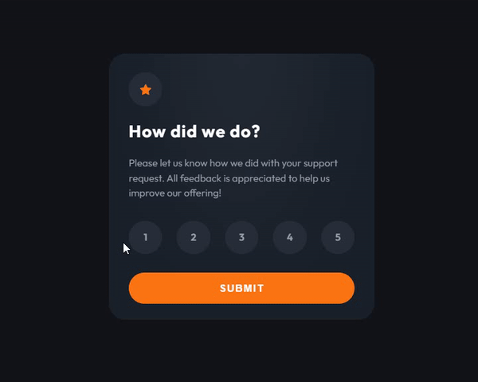

# Frontend Mentor - Interactive rating component solution

This is a solution to the [Interactive rating component challenge on Frontend Mentor](https://www.frontendmentor.io/challenges/interactive-rating-component-koxpeBUmI). Frontend Mentor challenges help you improve your coding skills by building realistic projects.

## Table of contents

- [Overview](#overview)
  - [The challenge](#the-challenge)
  - [Preview](#Preview)
  - [Links](#links)
- [My process](#my-process)
  - [Built with](#built-with)
  - [What I learned](#what-i-learned)
  - [Continued development](#continued-development)
- [Author](#author)

## Overview

### The challenge

Users should be able to:

- View the optimal layout for the app depending on their device's screen size
- See hover states for all interactive elements on the page
- Select and submit a number rating
- See the "Thank you" card state after submitting a rating

### Preview

<p align="center">
  
</p>

### Links

- Solution URL: [here](https://github.com/asmaahamid02/interactive-rating-component)
- Live Site URL: [here](https://asmaahamid02.github.io/interactive-rating-component/)

## My process

### Built with

- Semantic HTML5 markup
- CSS custom properties
- Flexbox

### What I learned

I learned how to work with radial gradient in css for the first time. I also learned how to use the 3d transform property to make the card flip.
Note that you have to use the transform-style: preserve-3d; property on the parent element to make the 3d transform work.

```css
.card {
  transform-style: preserve-3d;
}
```

If you want to increase the perspective of the 3d transform, you can use the perspective property on the top parent element.

```css
main {
  perspective: 1000px;
}
```

### Continued development

I want to improve my skills in css and javascript. I want to learn how to make more complex animations, how to use transform and transition properties better, and how to structure my code better.

## Author

- Website - [Asmaa Hamid](https://linktr.ee/asmaahamid02)
- Frontend Mentor - [@asmaahamid02](https://www.frontendmentor.io/profile/asmaahamid02)

